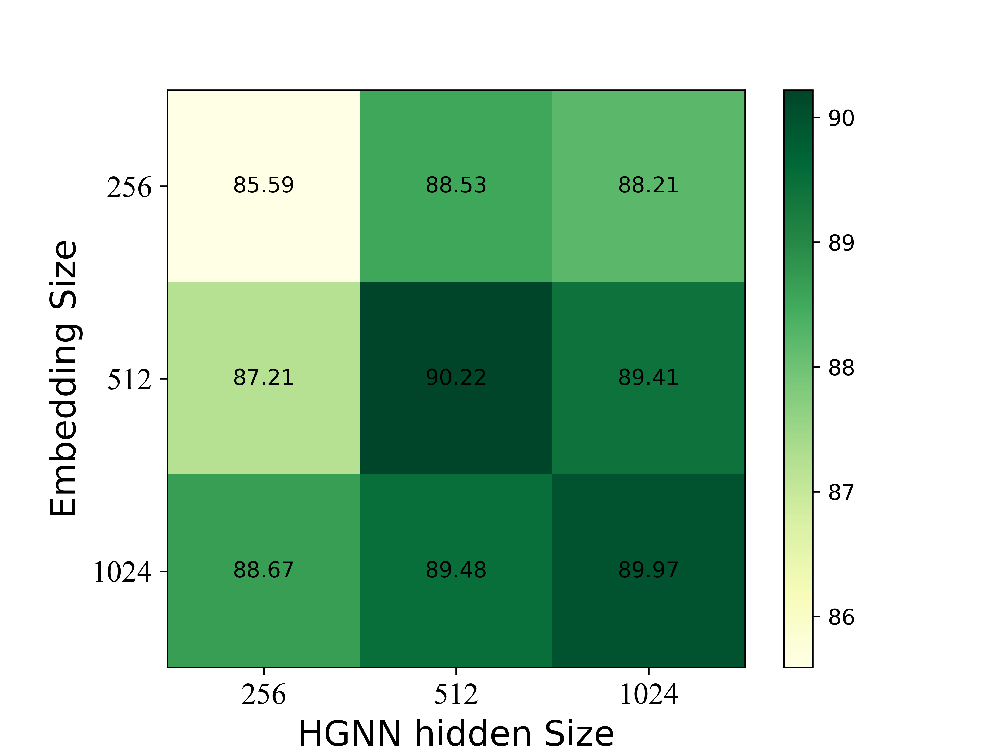

# [RE]  Hypergraph-Induced Semantic Tuplet Loss for Deep metric learning

Results reproduced for CVPR 2022 paper [**Hypergraph-Induced Semantic Tuplet Loss for Deep metric learning**](https://openaccess.thecvf.com/content/CVPR2022/papers/Lim_Hypergraph-Induced_Semantic_Tuplet_Loss_for_Deep_Metric_Learning_CVPR_2022_paper.pd). 

Our work aims to reproduce and  investigate the effectiveness and robustness of HIST loss with the following five claims, which point that: 
-  HIST loss performed consistently performance regardless of the batch size.
-  Regardless of the quantity of hyper-graph-neural-network(HGNN) layers L, the HIST loss shows consistent performance. 
- Positive value of the scaling factor α of semantic tuplets contributes reliable performance for modeling semantic relations of samples. 
-  Large temperature parameter τ is effective; if τ >16, HIST loss is insensitive to the scaling parameter.
-  HIST loss contributes to achieved SOTA performances on MLRC benchmark.


### Our reproduced results:

| **Backbone** |**Method** | **CUB-200-2011** | **CARS-196** | **SOP** |
| :--------------------------------: | :------------------------------: | :---------------------------------------: | :-----------------------------------: | :------------------------------: |
|                                    |                                  | R@1                                       | R@1                                   | R@1                              |
| BN-Inception      | [OA]HIST                     | **70.0**                      | 87.6                      | **79.8**             |
|                                    | [RE]HIST                     | 68.7                                   | 87.6                              | 77.4                          |
|                                    | [TUNE]HIST                   | **70.0**                      | **88.1**                          | 77.9                          |
| ResNet-50        | [OA]HIST                     | 71.6                                   | 89.8                              | **81.6**                     |
|                                    | [RE]HIST                     | 70.1                                   | 89.8                               | 80.7                          |
|                                    | [TUNE]HIST                   | **72.3**                      | **90.2**                  | 81.0                 |

[OA], [RE], [TUNE] denote the results were the highest scores quoted from original paper, reproduced based on the reported configurations in original paper, reproduced by our best-searched settings by Bayesian optimization. The best results are marked in **bold**.

### Joint contribution of hyperparameters on CARS196 using ResNet‐50

<table>
  <tr>
    <td>Hidden- and embedding-size</td>
     <td>tau and lambda_s</td>
  </tr>
  <tr>
    <td></td>
    <td></td>
  </tr>
 </table>


## Requirements

- Python3
* PyTorch
* [PyTorch Metric Learning](https://github.com/KevinMusgrave/pytorch-metric-learning)
* Numpy
* tqdm
* pandas
* matplotlib
* wandb (optional)

Our implementation was tested on the following libraries with Python 3.6.

* Install PyTorch:
```
pip install torch==1.7.1+cu101 torchvision==0.8.2+cu101 torchaudio==0.7.2 -f https://download.pytorch.org/whl/torch_stable.html
```

* Install the other dependencies:
```
pip install tqdm
pip install pandas
pip install matplotlib
pip install pytorch-metric-learning
pip install wandb
```

## Datasets

1. Download four public benchmarks for deep metric learning
   - [CUB-200-2011](https://www.vision.caltech.edu/datasets/cub_200_2011/)
   - [Cars-196](https://ai.stanford.edu/~jkrause/cars/car_dataset.html)
   - [Stanford Online Products](https://cvgl.stanford.edu/projects/lifted_struct/)
2. Extract the tgz or zip file into `./data/`


## Training HIST

In this repo, we also extended distance metrics and multi-layered HGNN (see `./hist.py`).

### Train *CUB-200-2011* on  backbone ResNet-50  (d=512) using **HIST loss**


```bash
python train.py --gpu-id 0
                --dataset cub
                --model resnet50
                --embedding-size 512
                --tau 24
                --alpha 1.15
                --epochs 40
                --lr 1.2e-4
                --lr-ds 1e-1
                --lr-hgnn-factor 5
                --weight-decay 5e-5
                --lr-decay-step 5
```


### Train *Cars196* on  backbone ResNet-50  (d=512) using **HIST loss**

```bash
python train.py --gpu-id 0
                --dataset cars
                --model resnet50
                --embedding-size 512
                --tau 32
                --alpha 0.8
                --epochs 50
                --lr 1e-4
                --lr-ds 1e-1
                --lr-hgnn-factor 10
                --weight-decay 1e-4
                --lr-decay-step 10
```


###  Train *Stanford Online Products* on  backbone ResNet-50  (d=512) using **HIST loss**

```bash
python train.py --gpu-id 0
                --dataset SOP
                --model resnet50
                --embedding-size 512
                --tau 20
                --alpha 2.1
                --epochs 
                --lr 1e-4
                --lr-ds 1e-2
                --lr-hgnn-factor 10
                --weight-decay 1e-4
                --lr-decay-step 10
                --bn-freeze 0
```


## Acknowledgements

Our code is modified and adapted on these great repositories:
- [Hypergraph-Induced Semantic Tuplet Loss for Deep Metric Learning](https://github.com/ljin0429/HIST) (CVPR 2022)
- [Proxy Anchor Loss for Deep Metric Learning](https://github.com/tjddus9597/Proxy-Anchor-CVPR2020) (CVPR 2020)
- [Hypergraph Neural Networks](https://github.com/iMoonLab/HGNN) (AAAI 2019)
- [PyTorch Metric Learning](https://github.com/KevinMusgrave/pytorch-metric-learning)

## Citation

If you use this method or this code in your research, please cite as:

    @inproceedings{lim2022hypergraph,
      title={Hypergraph-induced semantic tuplet loss for deep metric learning},
      author={Lim, Jongin and Yun, Sangdoo and Park, Seulki and Choi, Jin Young},
      booktitle={Proceedings of the IEEE/CVF Conference on Computer Vision and Pattern Recognition},
      pages={212--222},
      year={2022}
    }
